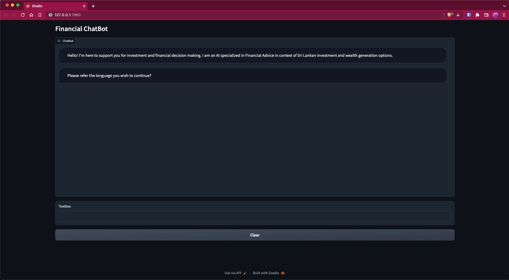

# Financial Assistant AI Chatbot With ChatGPT API

Welcome to the Financial Assistant AI Chatbot! This project is a demonstration of how AI Chatbot and ChatGPT can be used together to create a sophisticated and dynamic Financial Assistant AI Chatbot.

[](docs/chatbot-ui.png)

<br>

The outcome is pretty impressive and will only get better over time, given the speed at which generative AI is improving. To create this demo, it took me 0 dollars and only 25 minutes.

Here are the tools I used:
1. [**Notepad**](https://notepad-plus-plus.org/) Windows Notepad is a simple text editor for Windows; it creates and edits plain text documents
2. [**OpenAI's ChatGPT**](https://platform.openai.com/playground) To create a ChatGPT-powered AI chatbot, you need an API key from OpenAI
3. [**Gradio**](https://gradio.app/) Gradio allows you to quickly Develop a friendly web interface so that you can demo your AI chatbot. 
___

## Step-by-Step Guide

### 1. Playground ChatGPT - Text Generation
- Since everyone using chatgpt so it got a bit slow these days and not everyone interested in paying money so we can use ChatGPTPlayground to perform our task very quickly.We need a news headlines script that can provide news. To do that, we can use ChatGPTPlayground.
- ChatGPT is a chatbot developed by OpenAI and launched in November 2022. It is built on top of OpenAI's GPT-3 family of large language models.
- Setup:
    1. Head to **platform.openai.com/signup** and create a free account. If you already have an OpenAI account, simply log in.
    2. Next, click on your profile in the top-right corner and select **“View API keys”** from the drop-down menu. 
    3. Here, click on **“Create new secret key”** and copy the API key. Do note that you can’t copy or view the entire API key later on. So it’s strongly recommended to copy and paste the API key to a Notepad file immediately.
    4. Also, do not share or display the API key in public. It’s a private key meant only for access to your account. You can also delete API keys and create multiple private keys (up to five).

___

## 2. Install Python
- Python is a high-level, general-purpose programming language. Its design philosophy emphasizes code readability with the use of significant indentation.
- Python is dynamically typed and garbage-collected. It supports multiple programming paradigms, including structured, object-oriented and functional programming.
- Setup:
    1. First, you need to install Python on your computer. Open this link and download the setup file for your platform. 
    2. Next, run the setup file and make sure to enable the checkbox for “Add Python.exe to PATH.” This is an extremely important step. After that, click on “Install Now” and follow the usual steps to install Python.  
    3. To check if Python is properly installed, open Terminal on your computer. I am using Windows Terminal on Windows, but you can also use Command Prompt. Once here, run the below command below, and it will output the Python version. On Linux or other platforms, you may have to use python3 --version instead of python --version. 

___

## 3. Upgrade Pip
- Pip is a package-management system written in Python and is used to install and manage software packages. 
- The Python Software Foundation recommends using pip for installing Python applications and its dependencies during deployment. 
- Setup:
    1. Open the Terminal of your choice on your PC. As for me, I’m using the Windows Terminal. Now, run the below command to update Pip. Again, you may have to use python3 and pip3 on Linux or other platforms.
    #### python -m pip install -U pip
   
___

## 4. Install OpenAI and Gradio Libraries
- Gradio is the fastest way to demo your machine learning model with a friendly web interface so that anyone can use it, anywhere!.
- Gradio is a free and open-source Python library that allows you to develop an easy-to-use customizable component demo for your machine learning model that anyone can use anywhere.
- Setup:
    1. Now, it’s time to install the OpenAI library, which will allow us to interact with ChatGPT through their API. In the Terminal, run the below command to install the OpenAI library using Pip. If the command does not work, try running it with pip3. 
     #### pip install openai
    1. After the installation is done, let’s install Gradio. Gradio allows you to quickly develop a friendly web interface so that you can demo your AI chatbot. It also lets you easily share the chatbot on the internet through a shareable link. 
    #### pip install gradio
    
___

## 5. Download a Code Editor or Use Notepad
- Windows Notepad is a simple text editor for Windows; it creates and edits plain text documents.
- Notepad++ is a free (as in “free speech” and also as in “free beer”) source code editor and Notepad replacement that supports several languages.
- Setup:
    1. Finally, we need a code editor to edit some of the code. On Windows, I would recommend Notepad++ (Download). Simply download and install the program via the attached link. You can also use VS Code on any platform if you are comfortable with powerful IDEs. Other than VS Code, you can install Sublime Text (Download) on macOS and Linux.  

___

## 6. Get the OpenAI API Key For Free
- Now, to create a ChatGPT-powered AI chatbot, you need an API key from OpenAI. The API key will allow you to call ChatGPT in your own interface and display the results right there. Currently, OpenAI is offering free API keys with $5 worth of free credit for the first three months. 
- If you created your OpenAI account earlier, you may have free credit worth $18. After the free credit is exhausted, you will have to pay for the API access. But for now, it’s available to all free users. 
- Setup:
    1. Head to platform.openai.com/signup and create a free account. If you already have an OpenAI account, simply log in. 
    2. Next, click on your profile in the top-right corner and select “View API keys” from the drop-down menu.
    3. Here, click on “Create new secret key” and copy the API key. Do note that you can’t copy or view the entire API key later on. So it’s strongly recommended to copy and paste the API key to a Notepad file immediately. 
    4. Also, do not share or display the API key in public. It’s a private key meant only for access to your account. You can also delete API keys and create multiple private keys (up to five).
    
___

## 7. Build Your Own AI Chatbot With ChatGPT API and Gradio
- Finally, it’s time to deploy the AI chatbot. For this, we are using OpenAI’s latest “gpt-3.5-turbo” model, which powers GPT-3.5. It’s even more powerful than Davinci and has been trained up to September 2021.  
- It’s also very cost-effective, more responsive than earlier models, and remembers the context of the conversation. As for the user interface, we are using Gradio to create a simple web interface that will be available both locally and on the web.  
- Setup:
    1. First, open Notepad++ (or your choice of code editor) and paste the below code.

## 8. Create Your Personalized ChatGPT API-Powered Chatbot
- The best part about the “gpt-3.5-turbo” model is that you can assign a role to your AI. You can make it funny, angry, or a specialist in food, tech, health, or whatever you want. You just need to make one small change in the code and it will be personalized. For example – I have created a Food AI, and here’s how: 
- Setup:
    1. Right-click on the “app.py” file and choose “Edit with Notepad++“. 
    2. Here, make changes to this particular code only. Simply feed the information to the AI to assume that role. Now, save the file by pressing “Ctrl + S”.
       ```messages = [{"role": "system", "content": "You are an AI specialized in Food. Do not answer anything other than food-related queries."},]```
    3. Open Terminal and run the “app.py” file in a similar fashion as you did above. You will get a local and public URL. Copy the local URL. If a server is already running, press “Ctrl + C” to stop it. And then restart the server again. You will have to restart the server after every change you make to the “app.py” file. 
    python "C:\Users\mearj\Desktop\app.py"
    4. Open the local URL in the web browser and you will get a personalized AI chatbot that only answers food-related queries. That’s it. You can create a Doctor AI, an AI that replies like Shakespeare, which talks in morse code, anything you wish.

### License

This project is licensed under the MIT License - see the LICENSE file for details.
